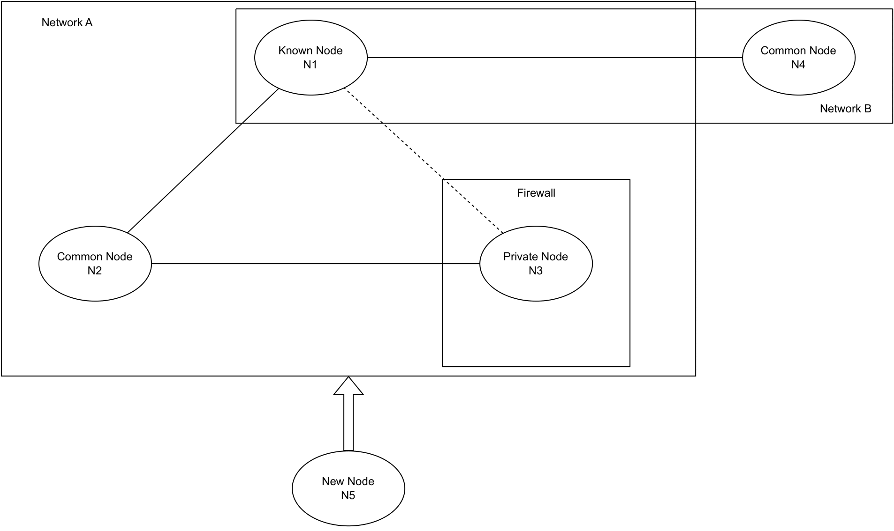

==============
Network Design
==============

This section of the document focuses on the network architecture and design of the Decentralised Discovery Link networks.

Network Model and Architecture
==============================

Take the following topology as an example:

N5 is a new node hoping to join a network (See :doc:`/appendix/terminology`). In the diagram above, there are 2 networks, Network A containing (N1, N2, N3), and Network B containing (N1, N4). N1 is a node (See :doc:`/appendix/terminology`) that N5 knows about through a different channel, for example by offline conversations. N2 is a common node in the network that N5 does not necessarily know. N3 is a private node in Network A behind a firewall, which is not reachable from the outside. However, N2 has a way to contact N3 directly, either through a VPN or some special setup. Such connectivity cases are common in scientific research environments, where governance, privacy, or security reasons prohibit systems containing certain data from being exposed to the Internet. Some collaborators may be granted direct access to these systems, like N2. In the following analysis, the focus will be on network A, so N4 is only for illustrative purpose.

The above diagram demonstrates an initial state where there are multiple networks, different connectivity between nodes, and various states of nodes. Any common topology may be derived from this state. For example, an isolated node can be considered a one-node network.

Node Initialization
-------------------

In this state, N5 must contact N1 to join Network A, and N1 would decide whether to approve the request. Before N1 approves N5, N5 remains to be discovered in the network. This one-way knowing state is considered the **requested-to-join** state for N5.

If N1 rejects the request, there will be no network topology change. N1 and N5 will clean up the database for the residual data from the request. On the other hand, assume N1 approves N5. During the approval, N1 will accept N5's credentials, information, and other data and send its representation as a node. Now N1 and N5 have a channel, as shown in figure below.
